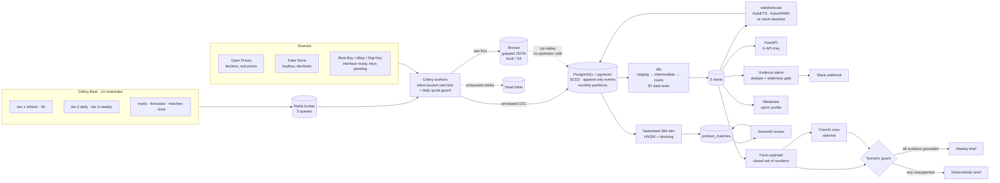
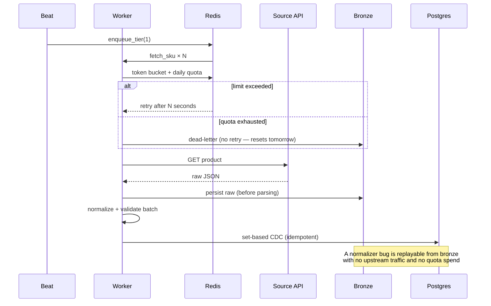

# Architecture

This describes what is **built and running**, not the original plan. Where the two
differ, the reason is noted — those differences are the interesting part.

## System

## Data flow

Beat enqueues per-source fetches → workers rate-limit, fetch, and write **raw to bronze
before parsing** → normalized rows land in Postgres through a set-based CDC path → dbt
builds marts and tests them → forecasts, alerts, matching and the weekly brief all read
marts, never raw tables.

## Deviations from the original plan, and why

| Planned | Built | Reason |
|---|---|---|
| Best Buy first | Open Prices + Fake Store first | Keyless sources prove the pipeline with zero approval latency; real sources drop into the same `SourceClient` interface |
| Open Food Facts | Open **Prices** | OFF has product attributes but no prices. Open Prices carries real observed prices, dates and store locations — actual multi-retailer competitor data |
| Row-by-row CDC | Row-by-row **plus** set-based | Row-by-row assumed a local DB. At 298 ms RTT a day's replay took an estimated 3.3 h; the set-based path does it in 41 s. Both kept, with a parity test |
| sentence-transformers | **fastembed** (ONNX) | Same `all-MiniLM-L6-v2` 384-dim model without torch (~2.5 GB) on a 7.4 GB machine |
| CrewAI writes the brief | Deterministic brief; CrewAI optional and gated | An unvalidated LLM brief is a liability in a pricing context. The guard is a hard gate, so the worst case is a plainer brief, never a wrong one |
| Deploy to AWS | Terraform written, **not applied** | Only phase that costs money (~$28–36/mo); nothing needs AWS to be demonstrated |

## Ingestion sequence

## Reliability properties

- **History is never overwritten.** Price and stock tables are append-only; a late or
  corrected observation adds a row.
- **Exactly one current product version**, enforced by a partial unique index.
- **Idempotent ingestion.** Every event carries a key hashed from source, product,
  retailer and a time bucket, uniquely indexed — replays collapse instead of duplicating.
- **The database is disposable.** Losing it is survivable because bronze holds every raw
  payload. This was proven under real failure: the Postgres volume was lost to a Docker
  storage fault and rebuilt in 30 seconds.
